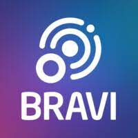

## Project Description <br/>

<p align="justify"> Technical challenge for the company Bravi, where the application must be able to register people and their contacts!! </p>

## Deploying the Application with Vercel

> http://challengebraviwebpage.vercel.app/

## Pre-requisites

:warning: [Yarn](https://classic.yarnpkg.com/pt-BR/docs/install/#windows-stable) 

## Running the Application :arrow_forward:

In the terminal, clone the project: 

```
git clone git@github.com:thdias00/challengebraviwebpage.git
```

Enter the project folder:  

```
cd challengebraviwebpage
```

Install dependences:

```
yarn install
```

Execute the application:

```
yarn start
```

There, now you can access the application from the route http://localhost:3000/ 

## JSON :floppy_disk:

For this application I used a database made with Node.JS that can be accessed through the link below: 

> https://github.com/thdias00/bravichallengeapi

## Frameworks, dependences and libs :books:

- React
- Javascript
- React-hook-form
- React-router-dom
- Axios

Framework for layout:
- Chakra UI

## Dev

[<br><sub>Thiago Dias</sub>](https://github.com/thdias00) 

> Status do Projeto: Concluido :heavy_check_mark: